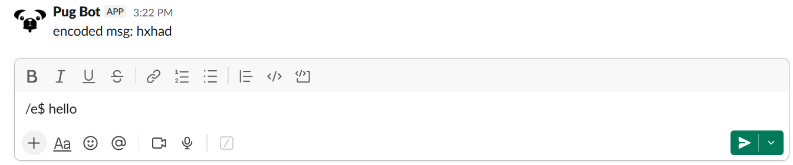
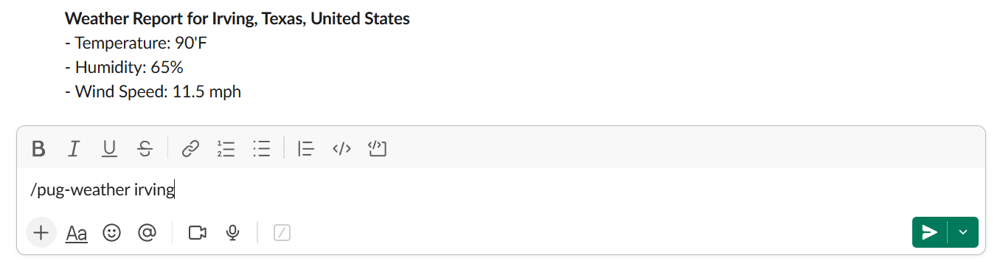

#First Slack Bot
a slack bot with cryptography and api based commands

what this project is: 
A slack bot built for the hack club slack workspace that lets you run cryptography tools, api utilities, and simple automation commands directly inside slack. It started as a small experiment for stardance but grew into a larger system for exploring backend development, apis, and basic cryptography design.

the bot is designed around a command system where everything is triggered through / commands. each command either performs a transformation (like encoding or decoding text), fetches external data through API's, or runs a utility function (like hashing).

the main goal of this project was to understand how irl bots connect multiple systems together: apis, persistent storage, and background processes.

how to use the bot:  
the bot is already installed in the hack club slack workspace. 
to use it: 
go to slack and run commands starting with / 
it is recommended to use the bot in the #msg-pug-bot channel or message it directly. 
example usage: 
/pug-help 
/pug-ping 
/e$ hello 

Note: almost all commands require an input after the command, separated by a space. 
setup (optional): 
if you want to run your own version:

https://slack.com/oauth/v2/authorize?client_id=2210535565.11260056134019&scope=chat:write,commands,app_mentions:read,channels:history&user_scope=

clone the repository: 
git clone https://github.com/no10123/First-Slack-Bot/ 
cd https://github.com/no10123/First-Slack-Bot/ 
npm install

set environment variables (create a .env file): 
SLACK_BOT_TOKEN=your_token 
SLACK_APP_TOKEN=your_token 
run the bot: 
node index.js

I learned a lot about what API's are and how they work, ssh servers, 
and hosting code, cryptography, and backend systems.

this project taught me how to:

build a slack bot using node.js and slack bolt 
work with external apis and async request handling 
connect multiple services together (slack, python services, external apis) 
store persistent data using local json files 
design command based systems that stay scalable as features grow 
deploy and host backend code on remote servers using ssh 
notable features 

the coolest part of this project is the custom encoding system built around /e$ and /d$. 
this system works like a stateful cipher where text is encoded based on a mutable key that can be changed or shuffled using /sk$ and reset with /rk. the key is stored persistently and can also be automatically rotated on a schedule.

this makes the system more than just a static cipher, since the output depends on runtime state rather than a fixed algorithm.

key commands:

/e$ encodes text using the custom cipher 
/d$ decodes encoded text 
/sk$ changes or shuffles the cipher key 
/rk resets the cipher key 

this system demonstrates: 
cryptographic design, custom algorithm design, and basic key management.

features

cryptography and utilities:

/e$ custom encoder
/d$ custom decoder
/sk$ key shuffle or set
/rk reset key
/hash$ hashing
/calc$ expression evaluation
/vigenere$ cipher
/rail$ rail fence cipher
/b64$ base64 encode/decode
/u$ unicode conversion

api and external tools:

/pug-catfact random cat fact
/pug-dogfact random dog fact
/pug-joke random joke
/translate$ text translation
/pug-weather weather lookup
/pug-remind scheduled reminders
/pug-rate currency conversion
/ai$ ai response via backend api

core:

/pug-help command list
/pug-ping latency test
/pug-echo text output

below are some img's showing how pug bot can be used

credits:
Built by me
Built for stardance

built by me
built for hack club stardance
